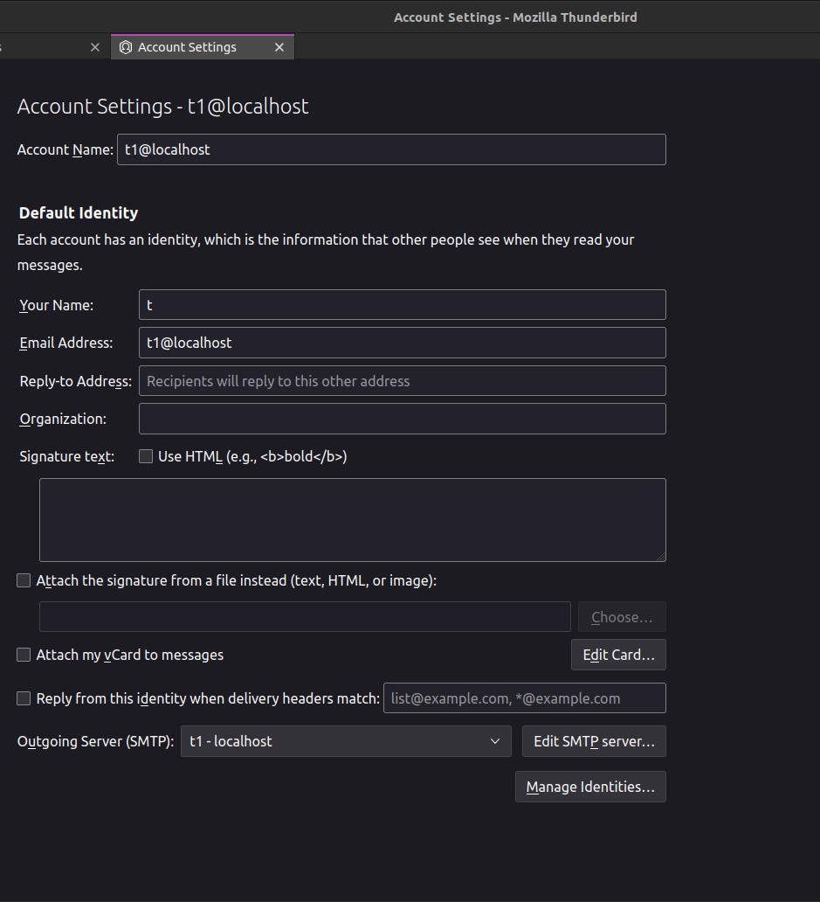

The document describes  possible tools to test the dovecot-ceph-plugin project manually.
======================
### 1: smtp test to test saving a mail
The directory path in the dovecot container where we should run the related command is /repo. After a success message from the server you can check ceph pools to check added objects.
    The command is :

    smtp-source -v -L -s 1 -m 1 -c -F /root/lmtp_test_mail.tld -f test@example.com -t t1 inet:127.0.0.1:1024

### 2: imaptest to test different operations such as copying mails
The directory path in the dovecot container where we should run the related command is /usr/local/bin.
    The command is : 

    ./imaptest user=t%d pass=t port=10143 users=100 clients=25 error_quit secs=30 output=/var/log/imaptest.log

There are two files as the results of the test one in the output path /var/log/imaptest.log and the other one in /var/log/dovecot.log 
#### 2_1: expectation 
imaptest.log must include some positive values(not zero) determining the number of different transactions such as copied mail ,...
    If you check dovecot.log you can follow the dovecot-ceph-plugin progress. The file must return 0 for all following checks. (remove -c from          following commands to see where the problem is and what is wrongly happening).

   - cat /var/log/dovecot.log | grep -c \"Error:\"
   - cat /var/log/dovecot.log | grep -c \"failed:\"
   - cat /var/log/dovecot.log | grep -c \"Internalerror\"
   - cat /var/log/dovecot.log | grep -c \"killed\"
   - cat /var/log/dovecot.log | grep -c \"Panic:\"
   - cat /var/log/dovecot.log | grep -c \"Fatal:\"
   - cat /var/log/imaptest.log | grep -c \"BUG:\"

you can remove dedicated period for test "secs=30" and monitor each mentioned command result in this way:

    tail -f  /var/log/dovecot.log | grep  \"Error:\" 

### 3: thunderbird Mail to test each operation on app
You are just needed to do some settings in section of Account Setting of the application as follow image.You can monitor the process and search for possible issues as it is explained in part 2_1(dovecot.log file). Please consider in the current test environment there are 100 users from t1 - t100 and their all password is t.
- 

### 4: telnet 

Exec into the container and
    Connect to the IMAP server using Telnet. Replace mail.example.com with the hostname or IP address of your IMAP server, and 143 with the appropriate port number if necessary.

    telnet localhost 10143

Once connected, you need to authenticate. Use the LOGIN command with your username and password. Replace username and password with your actual credentials.

    A LOGIN t1 t

If the authentication is successful, the server will respond with a success message, and you can proceed with other commands. You can monitor the process and search possible issues as it is explained in part 2_1(dovecot.log file). In the following there are a few examples of commands:
##### 4_1: List all mailboxes:

    A LIST "" "*"

##### 4_2: Select a mailbox (e.g., INBOX):
sql

    A SELECT INBOX

##### 4_3: Fetch the number of messages in the mailbox:
java

    A STATUS INBOX (MESSAGES)

##### 4_4: Fetch the first five message headers/ Fetch all messages: 
sql

    A FETCH 1:5 (BODY[HEADER])

    A FETCH 1:* BODY[]

##### 4_5: Store the first five messages with new flag(e.g., deleted):

    A STORE 1:5 -FLAGS (\deleted)
##### 4_6: Expunge deleted messages:

    Expunge
##### 4_7: Move/Copy selected messages from current selected mailbox to another mailbox(e.g., from INBOX to SPAM)

    MOVE 1:* <Another mailbox>
    COPY 1:5 <SPAM>
##### 4_8: There is the possibility to use doveadm commands to work on IMAP server

    the tutorial link: https://wiki2.dovecot.org/Tools/Doveadm/Mailbox  
##### 4_9: rados is a utility for interacting with a Ceph object storage:
    the tutorial link: https://docs.ceph.com/en/latest/man/8/rados/
    an example command to save mails: rados -p mail_storage ls - -n t1_u         
##### 4_10: Logout and close the connection:

    LOGOUT

Note: IMAP commands are case-insensitive, so you can use either uppercase or lowercase letters.

Remember to replace mail.example.com with the actual IMAP server address and modify the commands according to your specific needs. Additionally, some servers may use SSL/TLS encryption, so you may need to use the STARTTLS command to establish a secure connection before authenticating.

### 5: integration tests
There are some test files including unit tests to test different operations for example: ./it_test_read_mail_rbox to check different cases of reading a mail. You can run these files on path /repo/src/tests of dovecot container.